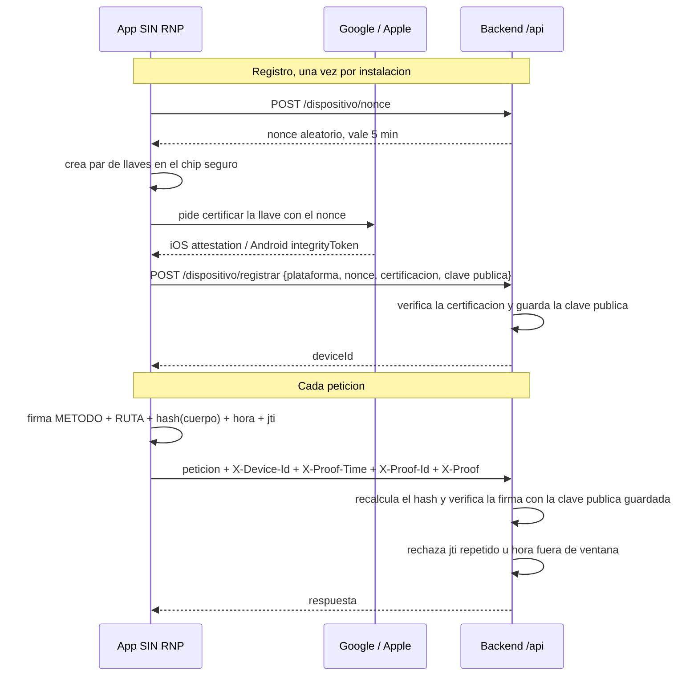

# Solo desde la app oficial · SIN RNP

16 de septiembre de 2026 · Registro Nacional de las Personas

Objetivo: que las solicitudes a la API solo puedan hacerse desde la app móvil oficial, y que nada de lo que se capture del tráfico sirva para reproducirlas desde Postman, cURL, scripts u otro aplicativo. Este documento describe la forma más corta de lograrlo.

## El principio

Todo lo que la app guarde o envíe se puede extraer: la API key del bundle, un token del tráfico, un identificador del almacenamiento. La única excepción es una llave privada creada dentro del chip seguro del teléfono (Secure Enclave en iPhone, StrongBox o TEE en Android): se puede usar para firmar, pero no se puede copiar, ni siquiera con root. El diseño entero se apoya en eso.

Deben cumplirse tres condiciones, y las tres son verificables desde el servidor:

1. **La llave nace certificada.** Apple (App Attest) y Google (Play Integrity) dan fe de que la llave se creó dentro de la app oficial, sin modificar, en un teléfono íntegro. El servidor solo registra llaves públicas que lleguen con ese certificado. Sin esto, cualquiera registra una llave hecha en Postman.
2. **Cada petición va firmada con esa llave.** La firma cubre método, ruta, cuerpo, hora y un identificador único. Cambiar el DNI rompe la firma; repetirla falla porque el identificador ya se usó; guardarla falla porque la hora vence.
3. **El servidor no confía en nada más.** Ni en la API key, ni en cabeceras, ni en que la app diga que es la app. Solo en la firma verificada con la llave pública que registró.

Con eso, esto es lo que ve y lo que puede hacer quien capture el tráfico descifrado en su propio teléfono:

| Lo que viaja | ¿Lo ve? | ¿Le sirve en Postman, cURL o un script? |
| --- | --- | --- |
| `X-API-KEY` | Sí | No: sin firma no pasa el primer middleware |
| `X-Device-Id` | Sí | No: es público, como un nombre de usuario |
| `X-Proof` (la firma) | Sí | No: vale para esa petición exacta, una sola vez, dos minutos |
| Hora e identificador de la petición | Sí | No: el identificador queda gastado |
| Llave privada | Nunca viaja | Es lo único que fabrica firmas válidas, y vive en el chip |

Lo que le queda a un atacante es instalar la app oficial en un teléfono real y usarla. Eso es, por definición, usar la app móvil.

## Cómo funciona

Dos momentos. El **registro** ocurre una vez por instalación y es el único paso donde intervienen Google o Apple. La **firma** ocurre en cada petición, es local al teléfono y se verifica localmente en el servidor, sin llamadas externas.



**Qué hace cada plataforma**

| | iOS | Android |
| --- | --- | --- |
| Crear la llave | App Attest, `generateKeyAsync()` | Android Keystore con StrongBox o TEE, `generateHardwareAttestedKeyAsync()` |
| Certificarla al registrar | `attestKeyAsync(keyId, nonce)` devuelve el objeto de atestación de Apple | Play Integrity, `requestIntegrityCheckAsync(SHA-256(clavePublica + nonce))` devuelve un token firmado por Google que ata la app, el dispositivo y esa clave |
| Firmar cada petición | `generateAssertionAsync(keyId, hash)`; Apple incluye un contador que solo sube | Firma ECDSA con la llave del Keystore, mediante un módulo nativo de unas 100 líneas |
| Verificar en el servidor al registrar | Cadena de certificados hasta la raíz de Apple, sin llamada a Apple | Una llamada a la API de Google para decodificar el token |
| Verificar en el servidor cada petición | Firma ECDSA con la clave pública guardada, local | Firma ECDSA con la clave pública guardada, local |

**Por qué esta es la forma más corta.** Google y Apple solo se usan al registrar, así que la cuota por defecto de Play Integrity alcanza y un teléfono ya registrado sigue funcionando aunque su servicio falle. Verificar una firma ECDSA es una línea de OpenSSL en cualquier lenguaje. No hay tokens de sesión que renovar ni revocar. El único código nativo es el módulo de firma en Android, porque el módulo de Expo crea la llave pero no expone firmar con ella.

## Backend paso a paso

Dos endpoints nuevos, una tabla, un middleware y dos variables de entorno. Las rutas actuales no cambian.

1. **Cuentas.** En Google Cloud: habilitar Play Integrity API, vincular el proyecto con la app `info.rnphn.sin_rnp` en Play Console y crear una cuenta de servicio con permiso de Play Integrity; su JSON vive solo en el servidor. En Apple Developer: activar App Attest en el App ID `rnphn.info.sinrnphn80`; guardar en el servidor la raíz Apple App Attestation Root CA y el Team ID.
2. **Tabla `dispositivos`.** Columnas: `id` (UUID), `plataforma`, `clave_publica` (PEM), `key_id` (iOS), `ultimo_contador` (iOS), `veredicto`, `creado`, `ultimo_uso`, `bloqueado`.
3. **`POST /dispositivo/nonce`.** Genera 32 bytes aleatorios, los guarda 5 minutos con su hora, y los devuelve en base64. Límite: 20 por minuto por IP.
4. **`POST /dispositivo/registrar`.** Recibe plataforma, nonce, certificación y clave pública. Comprueba que el nonce exista y no se haya usado. Verifica la certificación según la tabla de abajo. Si todo pasa, crea la fila en `dispositivos` y devuelve el `deviceId`. Límite: 5 registros por día por IP.
5. **Middleware `prueba.dispositivo`.** Se aplica a todas las rutas de `/api` salvo las dos anteriores y la de parámetros de versión (para que la pantalla de actualización obligatoria siga funcionando). Va antes del middleware de `X-API-KEY`.
6. **Variables.** `PRUEBA_DISPOSITIVO_OBLIGATORIA`: en `false` el middleware registra en log las peticiones sin firma y las deja pasar; en `true` las rechaza. `INTEGRIDAD_ANDROID`: `DEVICE` o `STRONG`.
7. **Límites por dispositivo.** 120 peticiones por minuto por `deviceId` y bloqueo manual poniendo `bloqueado = true`. Cada petición lleva la identidad del teléfono que la firmó, así que un abuso se rastrea y se corta.

**Qué verifica el registro**

| Plataforma | Comprobación | Qué evita |
| --- | --- | --- |
| Android | Decodificar el token con la API de Google (`decodeIntegrityToken`) | Token falsificado |
| Android | `requestPackageName` = `info.rnphn.sin_rnp` | Otra app usando la API |
| Android | `requestHash` = SHA-256(clave pública + nonce) y `timestampMillis` menor a 5 min | Registrar una clave distinta a la certificada, o reenviar |
| Android | `appRecognitionVerdict` = `PLAY_RECOGNIZED` | APK modificado o firmado por otro |
| Android | `deviceRecognitionVerdict` contiene `MEETS_DEVICE_INTEGRITY` (o `MEETS_STRONG_INTEGRITY` según la variable) | Emuladores y teléfonos alterados |
| iOS | Cadena de certificados del objeto de atestación hasta la raíz de Apple | Prueba fabricada |
| iOS | `rpIdHash` = SHA-256 de `TEAMID.rnphn.info.sinrnphn80` | Otra app del mismo equipo |
| iOS | Nonce del certificado = SHA-256(authData + SHA-256(nonce)) | Reenvío |
| iOS | `keyId` = SHA-256 de la clave pública extraída del certificado; contador inicial 0 | Suplantar la llave |

**Contrato de cada petición**

```http
GET /api/obtenerCertificadoNacimiento/0801199012345
X-API-KEY: <clave de la app>
X-Device-Id: 7f3c2a9e-...
X-Proof-Time: 1789689600
X-Proof-Id: 3b1e...-uuid
X-Proof: <firma en base64>
```

La cadena que se firma, con saltos de línea entre partes:

```
METODO
RUTA (sin host, con query si la hay)
SHA-256(cuerpo) en hex, o SHA-256 de cadena vacía si no hay cuerpo
X-Proof-Time
X-Proof-Id
X-Device-Id
```

**Qué hace el middleware en cada petición**

1. Lee `X-Device-Id`; busca la fila; si no existe o está bloqueada, rechaza.
2. Comprueba que `X-Proof-Time` esté dentro de más o menos 120 segundos de la hora del servidor.
3. Comprueba que `X-Proof-Id` no se haya visto en los últimos 5 minutos y lo marca como usado de forma atómica (Redis `SET NX EX 300`, o tabla con clave única).
4. Reconstruye la cadena con la petición real y calcula su SHA-256.
5. iOS: verifica la assertion con la clave pública guardada, comprueba `rpIdHash` y que el contador sea mayor al último; guarda el nuevo. Android: verifica la firma ECDSA P-256 con SHA-256 sobre el hash, con la clave pública guardada.
6. Actualiza `ultimo_uso` y sigue al siguiente middleware.

| Caso | HTTP | Cuerpo |
| --- | --- | --- |
| Falta alguna de las cuatro cabeceras | 401 | `{"error":"prueba_requerida"}` |
| Dispositivo desconocido, firma no coincide, contador no sube | 401 | `{"error":"prueba_invalida"}` |
| `X-Proof-Id` repetido | 401 | `{"error":"prueba_repetida"}` |
| `X-Proof-Time` fuera de ventana | 401 | `{"error":"prueba_vencida"}` |
| Dispositivo bloqueado | 403 | `{"error":"dispositivo_bloqueado"}` |
| Demasiadas peticiones del dispositivo o la IP | 429 | `{"error":"demasiadas_solicitudes"}` |

**Librerías.** La firma ECDSA se verifica con OpenSSL en cualquier lenguaje (`openssl_verify` en PHP, `crypto.verify` en Node). Play Integrity: cliente oficial de Google (`google/apiclient` en Laravel, `googleapis` en Node). App Attest: Apple no ofrece API, se validan CBOR y X.509 siguiendo su guía de nueve pasos; en Node hay librerías que lo hacen; si el backend es Laravel y no hay librería madura, un microservicio Node de verificación solo para el registro es la salida más rápida.

## Frontend paso a paso

Un módulo de Expo, un módulo nativo pequeño para Android, un archivo nuevo de sesión y un interceptor. Las pantallas no cambian, salvo la de inicio.

1. **Instalar `@expo/app-integrity`** con `npx expo install @expo/app-integrity`. Es el módulo oficial de Expo para App Attest y Play Integrity; en SDK 54 está en alfa, así que se prueba a fondo en staging. iOS: agregar el entitlement `com.apple.developer.devicecheck.appattest-environment` con valor `production` en `app.json`; EAS sincroniza la capability. Android: la app debe estar subida a Play Console, la pista interna sirve, para que el veredicto sea `PLAY_RECOGNIZED`.
2. **Módulo nativo de firma para Android.** Con `npx create-expo-module --local keystore-sign`. Un solo método `sign(keyAlias, hashBase64)` que abre `AndroidKeyStore`, toma la llave privada del alias que creó `generateHardwareAttestedKeyAsync` y firma con `SHA256withECDSA`. Un segundo método `publicKey(keyAlias)` que devuelve la clave pública en PEM para el registro. Unas 100 líneas de Kotlin. Los builds ya se hacen con EAS, así que no cambia el flujo.
3. **Nuevo `services/api/deviceSession.js`.** Dos funciones:
    - `registrarDispositivo()`: pide el nonce; en iOS `generateKeyAsync()` y `attestKeyAsync(keyId, nonce)`; en Android `generateHardwareAttestedKeyAsync(alias, nonce)`, `publicKey(alias)` y `requestIntegrityCheckAsync(SHA-256(clavePublica + nonce))`; envía todo a `/dispositivo/registrar` y guarda `deviceId` y `keyId` o alias en SecureStore (`utils/secure-store.ts` ya existe). Se llama una vez por instalación.
    - `firmarPeticion(config)`: arma la cadena canónica con método, ruta, hash del cuerpo, hora, un UUID nuevo y `deviceId`; calcula el SHA-256 con `expo-crypto`; en iOS llama a `generateAssertionAsync(keyId, hash)` y en Android a `sign(alias, hash)`; devuelve las cuatro cabeceras.
4. **`services/api/client.js`.** Interceptor de petición que llama a `firmarPeticion` y agrega `X-Device-Id`, `X-Proof-Time`, `X-Proof-Id` y `X-Proof`. Va después de `installApiMiddlewares`, para que el caché y el throttle actuales sigan funcionando y no se firme lo que no se envía. Interceptor de respuesta: ante 401 `prueba_vencida` o `prueba_repetida`, reintenta una vez con firma nueva; ante `prueba_invalida` o `dispositivo_bloqueado`, dispara el evento global de dispositivo no válido.
5. **`app/(tabs)/index.tsx`.** Al arrancar, después de la verificación de versión y antes de habilitar el menú, llamar a `registrarDispositivo()` si no hay `deviceId` guardado. Si falla o llega el evento de dispositivo no válido: pantalla bloqueante con el mensaje de instalación no verificada, botón de reintentar y enlace a la tienda, con la misma mecánica que la pantalla de actualización obligatoria que ya existe ahí.
6. **`services/api/wallet.js`.** La descarga directa del `.pkpass` usa `FileSystem.downloadAsync` y no pasa por axios: llamar a `firmarPeticion` para ese GET y pasar las cuatro cabeceras junto a `X-API-KEY`.
7. **Textos** en `locales/es.json` y `locales/en.json`: título y mensaje de instalación no verificada, botón de reintentar.
8. **Staging.** Los builds de desarrollo no vienen de Play ni de TestFlight y no pasan la certificación. En apptest se trabaja con `PRUEBA_DISPOSITIVO_OBLIGATORIA=false`; producción nunca acepta ese modo.

| Archivo | Qué se hace |
| --- | --- |
| `package.json`, `app.json` | Módulo de Expo y entitlement de App Attest |
| `modules/keystore-sign/` | Nuevo. Firma ECDSA con el Keystore en Android |
| `services/api/deviceSession.js` | Nuevo. Registro del teléfono y firma de peticiones |
| `services/api/client.js` | Interceptor que firma y maneja los 401 |
| `app/(tabs)/index.tsx` | Registro al arrancar y pantalla bloqueante |
| `services/api/wallet.js` | Firma en la descarga directa del `.pkpass` |
| `locales/es.json`, `locales/en.json` | Tres textos nuevos |

## Plan de cuatro semanas

Backend y app avanzan en paralelo. El backend sale primero en modo observación, la app después, y la obligatoriedad se activa el mismo día que se fuerza la actualización. Ninguna versión de la app queda rota sin aviso.

| Semana | Backend | App | Listo cuando |
| --- | --- | --- | --- |
| 1 | Cuentas en Google Cloud y Apple Developer. Tabla `dispositivos`. Endpoints de nonce y registro en apptest con verificación de Android e iOS. Middleware en observación | Módulo de Expo, módulo nativo de firma, `registrarDispositivo()`. Build `staging` | Un teléfono real de cada plataforma se registra en apptest |
| 2 | Verificación de firma en el middleware. Límites y bloqueo. `PRUEBA_DISPOSITIVO_OBLIGATORIA=true` en apptest | `firmarPeticion()` e interceptor. Pantalla bloqueante. Build a TestFlight y a la pista interna de Play | Checklist de pruebas completo en verde con la obligatoriedad activa |
| 3 | Despliegue en producción con `OBLIGATORIA=false`. El log mide cuánto tráfico llega sin firma y cuántos registros fallan por tipo de teléfono | Envío a App Store y Play Store | App aprobada en ambas tiendas; porcentaje de teléfonos que no pasan conocido |
| 4 | Día de activación y vigilancia de 401, 403 y 429 | Nada | Solo apps viejas reciben 401, y ya ven la pantalla de actualización |

**Día de activación, en este orden**

1. Confirmar que la versión nueva está disponible en las dos tiendas.
2. Poner los parámetros `VerisonIOS` y `VerisonAndroid` en la versión nueva. La app ya compara su versión con ellos al abrir y bloquea con la pantalla de ir a la tienda (`app/(tabs)/index.tsx`), así que las versiones viejas dejan de llamar a la API por sí solas.
3. Cambiar `PRUEBA_DISPOSITIVO_OBLIGATORIA` a `true`.
4. Vigilar una semana. Un pico de `prueba_invalida` desde un mismo `deviceId` es un teléfono alterado: bloquearlo. Un pico de `prueba_vencida` es un problema de reloj: revisar la ventana.

Si las tiendas tardan distinto, se puede activar con la versión de una sola plataforma y poner la otra en `MANTENIMIENTO` con el mismo parámetro hasta que apruebe.

**Sobre la `X-API-KEY`.** Sigue viajando y sigue exigiéndose, pero desde el día de activación ya no autoriza nada: sin firma no se llega a ella. Se puede rotar ese mismo día para invalidar la que ya es conocida fuera del RNP.

## Pruebas

Se corren contra apptest con `PRUEBA_DISPOSITIVO_OBLIGATORIA=true`. Lo que debe fallar es la prueba real del objetivo: son exactamente los intentos que haría alguien con el tráfico capturado.

**Debe fallar**

- [ ] Cualquier ruta sin las cuatro cabeceras de prueba responde 401 `prueba_requerida`
- [ ] Capturar una petición real de la app con un proxy y reenviarla idéntica con cURL responde 401 `prueba_repetida`
- [ ] La misma captura con el DNI de la ruta cambiado responde 401 `prueba_invalida`
- [ ] La misma captura con un `X-Proof-Id` nuevo responde 401 `prueba_invalida`, porque la firma cubría el anterior
- [ ] La misma captura reenviada 3 minutos después responde 401 `prueba_vencida`
- [ ] iOS: reenviar una firma con el contador ya usado responde 401 `prueba_invalida`
- [ ] Registrar una llave generada con OpenSSL y una certificación inventada es rechazado por `/dispositivo/registrar`
- [ ] Registrar con un token de Play Integrity cuyo `requestHash` no coincide con la clave enviada es rechazado
- [ ] Registrar desde un emulador Android o un simulador iOS es rechazado
- [ ] Un APK reempaquetado y firmado con otra llave no obtiene `PLAY_RECOGNIZED` y es rechazado
- [ ] Un `deviceId` con `bloqueado = true` responde 403 en todo
- [ ] La petición 121 en un minuto desde el mismo `deviceId` responde 429
- [ ] Un token de Play Integrity o una atestación de Apple emitidos para apptest no registran en producción

**Debe funcionar**

- [ ] Una instalación limpia se registra en el primer arranque sin intervención del usuario y navega normal
- [ ] Cerrar y volver a abrir la app no vuelve a registrar; sigue firmando con la misma llave
- [ ] Reinstalar la app produce un registro y un `deviceId` nuevos
- [ ] Todos los flujos actuales funcionan con la obligatoriedad activa: certificado, árbol, Wallet, validar DNI, pre-enrolamiento, traslados, noticias, expedientes
- [ ] La descarga directa del `.pkpass` funciona firmada
- [ ] Con el reloj del teléfono adelantado un minuto funciona; adelantado diez minutos muestra el mensaje de error y no un fallo silencioso
- [ ] En modo observación, una petición sin firma pasa y queda registrada en el log con la ruta y la IP
- [ ] Con la salida hacia Google y Apple bloqueada en el servidor, los teléfonos ya registrados siguen funcionando; solo fallan los registros nuevos
- [ ] Probado en un Android de gama baja con Android 10 o anterior y en el iPhone más viejo que soporte la app

## Límites honestos y decisiones

**Lo que este diseño no hace**

- Un teléfono real, rooteado y con herramientas de hooking puede pedirle a la app oficial que firme peticiones por él. No puede sacar la llave, pero puede usarla mientras la app corre ahí. Lo detecta el veredicto de integridad al registrar: `MEETS_STRONG_INTEGRITY` casi no se falsifica, `MEETS_DEVICE_INTEGRITY` a veces sí. Aun así ese atacante está usando la app en un teléfono real, identificado, con límite de 120 peticiones por minuto y bloqueable. Ninguna solución llega al 100 %; esta es la más cercana que existe hoy.
- No decide qué DNI puede consultar un usuario legítimo desde la app oficial. Para eso está el token por escaneo del Plan de remediación API Key. Los dos diseños se complementan y comparten el mismo interceptor.
- Teléfonos Android sin servicios de Google (Huawei y similares) o sin chip seguro, e iPhones con iOS anterior a 14, no pueden registrarse.
- Google y Apple son raíz de confianza, pero solo al registrar. Si su servicio falla, los teléfonos ya registrados siguen funcionando.
- `@expo/app-integrity` está en alfa. Si da problemas, la parte de iOS también cabe en el módulo nativo: la API de App Attest son tres llamadas.
- Costo en el teléfono: firmar toma menos de 10 ms. En el servidor, verificar toma menos de 1 ms. No hay latencia perceptible.

**Decisiones que debe tomar el RNP antes de la semana 3**

| Decisión | Opciones | Recomendación |
| --- | --- | --- |
| Teléfonos que no pueden registrarse | Bloquear con mensaje claro, o dejarles solo catálogos y noticias | Medir el porcentaje en la semana 3 y luego bloquear; un camino alterno se vuelve el agujero |
| Nivel de integridad Android | `DEVICE` o `STRONG` | Empezar con `DEVICE`; `STRONG` deja fuera teléfonos viejos o baratos |
| Rutas exentas de firma | Solo nonce, registro y parámetros de versión | Ninguna más; cada excepción es un endpoint abierto |
| Ventana de hora y caché de identificadores | 120 s y 5 min | Empezar así y ajustar según los rechazos por reloj |
| Volver a certificar el teléfono | Nunca, o cada 30 días | Cada 30 días: es barato y renueva el veredicto de integridad |
